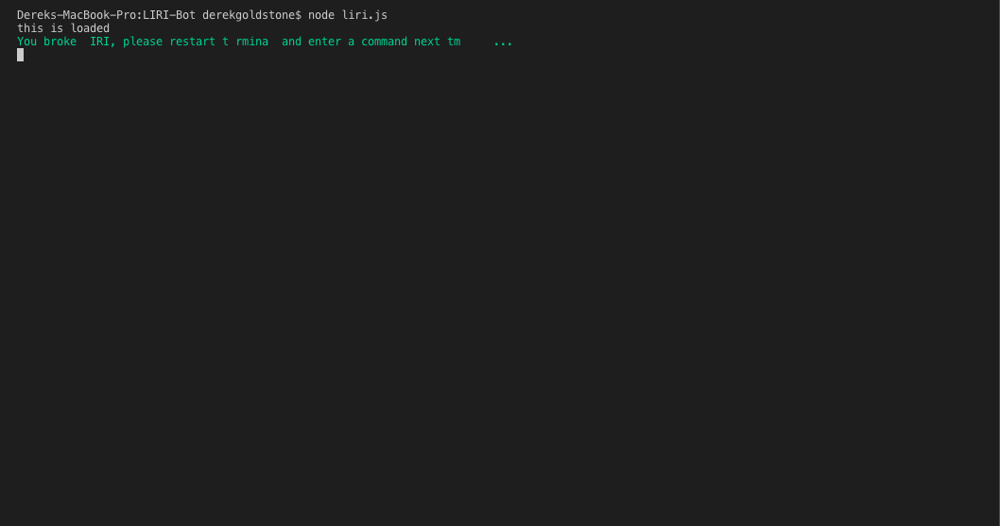

# LIRI-Bot

___

### Design

This node.js command line application utilized chalk and chalk animation to engage the user and provide color to the interface. Bright green was chosen because it reminded me of the computer terminal my grandparents had on the computer in their business circa the 90's. Certain results were boldened such as movie name to highlight pertinent informatiob. The glitch animation was chosen for the default error message. Furthermore, line segments were logged above and below results to provide separation of text and improve readability.

### Logic

First variables assigned to require each package needed for this application. Then I accessed the command line inputs by assigning a variable named command to index 2 of the command line using process.argv and everything following it as args using the slice method at index 3. I then created a switch statement that determines if a command has been issued and calls the corresponding function. For example, the movie-this command that takes in args as the argument to the movieThis function, if no arugment is provided it will default to Mr. Nobody. If no argument is provided an error message will be issued that intentionally breaks the command line and forces the user to restart the terminal and enter a command followed by some input. The first function concertThis makes use of axios to request data from the bands in town api. The results were then iterated through in a for loop  to display the top three concert dates for a given artist provided as an argument in the function. Venue name, location, and concert date were then provided. However, datatime was displayed with the year first. I then formatted datetime using moment().format("L") for US style internationalization (MM-DD-YYYY). The next function spotifySongSearch takes an argument of song and searches spotify's api for the queried song title and returns the artist name, song title, album name, and a preview of the song on spotify. I subsequently declared a function movieThis that takes in a movie title as an argument then uses axios to request a JSON object from omdb's API. The response data was then stored in a variable called movieJSON for easier accessing of keys. Then the keys corresponding to movie title, release year, imdb rating, rotten tomatoes rating, country, and language were logged to console. Lastly, the doWhatItSays function reads the random.txt file, splits the input data provided at the comma, and determines which command is being issued with a given input, in this case, spotify-this-song "I Want It That Way".

## Built With

___

* [JavaScript](https://developer.mozilla.org/en-US/docs/Web/JavaScript/Reference)
* [Node.js](https://nodejs.org/en/docs/)
* [Moment.JS](https://momentjs.com/docs/)
* [Spotify API](https://developer.spotify.com/documentation/web-api/)
* [OMDB API](http://www.omdbapi.com/)
* [Bands In Town API](https://app.swaggerhub.com/apis-docs/Bandsintown/PublicAPI/3.0.0)
* [Axios](https://github.com/axios/axios)
* [dotenv](https://www.npmjs.com/package/dotenv)
* [chalk](https://www.npmjs.com/package/chalk)
* [chalk-animation](https://www.npmjs.com/package/chalk-animation)

___

___

## Authors

* Derek Goldstone - [UC Berkeley Extension](https://www.linkedin.com/in/derek-goldstone-482884a3/)

___